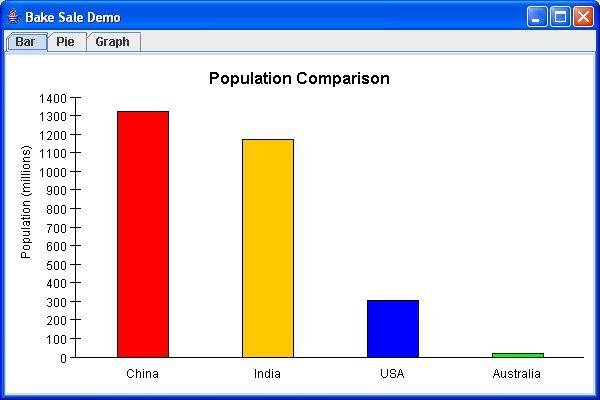

A stripped-down Java library for rendering pie charts, bar charts, and function graphs in Java Swing panels.

The test/org.computronium.bakesale.demo.BakeSaleDemo.java class contains a simple example of how to use them.

